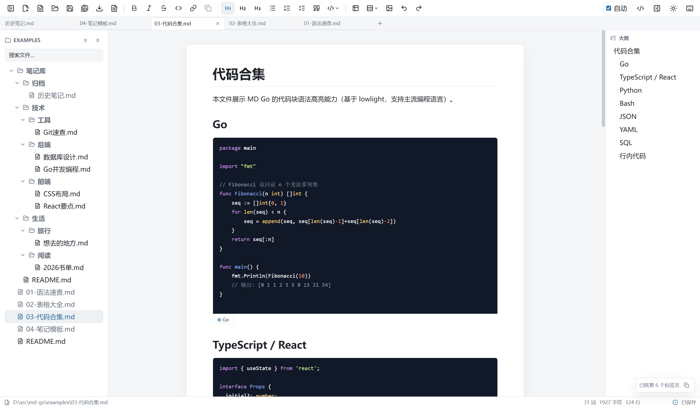

# MD Go

> 一个轻量、原生、中文友好的桌面 Markdown 工作区。

MD Go 是基于 **Wails + React + Go** 构建的桌面 Markdown 编辑器。它使用系统原生 WebView 而非 Electron，体积小、启动快；并以「工作区」为核心组织文档——文件树、多标签页、跨文件全文搜索，像管理代码一样管理你的 Markdown。



## 核心特性

- **所见即所得 / 源码双模式**：基于 [TipTap](https://tiptap.dev) 的富文本编辑，一键切换源码模式
- **工作区式管理**：文件夹树、多标签页（锁定 / 拖拽重排 / 批量关闭）、跨文件全文搜索
- **完整写作工具链**：标题、有序/无序/任务列表、引用、表格（行列增删）、代码块（语法高亮）、行内代码、链接、图片
- **图片能力**：粘贴 / 拖拽插入、可缩放、本地图片自动内联到导出
- **本地链接跳转**：点击 `.md` 链接直接打开对应文件
- **导出**：HTML / PDF。PDF 基于系统 Chromium 打印，未安装时自动回退为 HTML
- **效率工具**：命令面板（Ctrl+P）、可自定义的全局快捷键、大纲、文件导航历史（Alt + ← / →）
- **安全与持久化**：工作区操作沙箱化（拒绝越界路径）、删除走回收站、自动保存、外部文件变更检测、会话恢复
- **完整中文界面**

## 技术栈

| 层 | 技术 |
|----|------|
| 桌面框架 | [Wails v2](https://wails.io) · Go 1.23 |
| 前端 | React 18 · TypeScript · Vite |
| 编辑器内核 | [TipTap v3](https://tiptap.dev) |
| Markdown | marked · turndown · lowlight（代码高亮）|

## 下载

前往 [Releases](https://github.com/pithy-share/md-go/releases) 下载 `md-go.exe`（Windows），双击运行。

## 从源码构建

前置依赖：[Go 1.23+](https://go.dev/dl/)、[Node.js](https://nodejs.org/)、[Wails CLI](https://wails.io/docs/gettingstarted/installation)。

```bash
git clone https://github.com/pithy-share/md-go.git
cd md-go
wails dev      # 开发模式，热重载
wails build    # 产出 build/bin/md-go.exe
```

## 项目结构

```
md-go/
├── main.go / app.go        # 程序入口与 Wails 绑定
├── internal/               # 后端服务
│   ├── config/             #   配置读写
│   ├── files/              #   工作区文件操作（含回收站）
│   ├── export/             #   HTML / PDF 导出
│   ├── hotkeys/            #   快捷键管理
│   └── models/             #   数据模型
├── frontend/src/
│   ├── components/         # 工具栏 / 侧边栏 / 标签栏 / 命令面板 / 状态栏
│   ├── editor/             # TipTap 编辑器封装与 Markdown 转换
│   ├── state/              # 文档状态、工作区会话
│   └── hooks/              # useAppConfig / useTabs
├── build/                  # 图标与打包资源
└── wails.json              # Wails 项目配置
```

## 许可证

[MIT License](./LICENSE) © 2026 zhangyong
